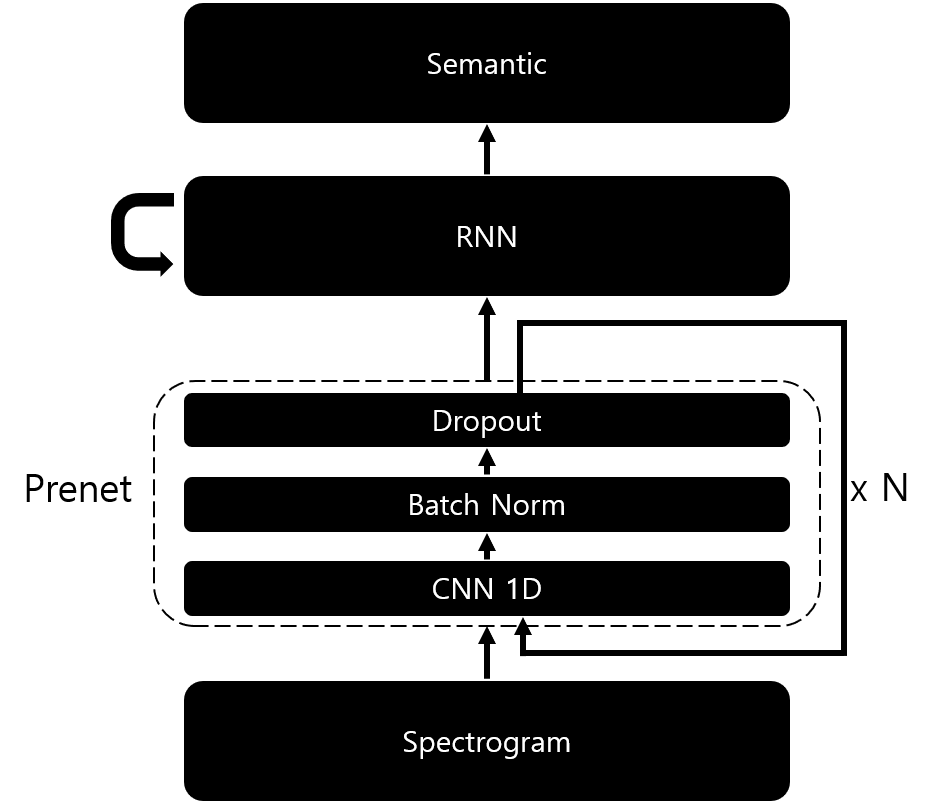
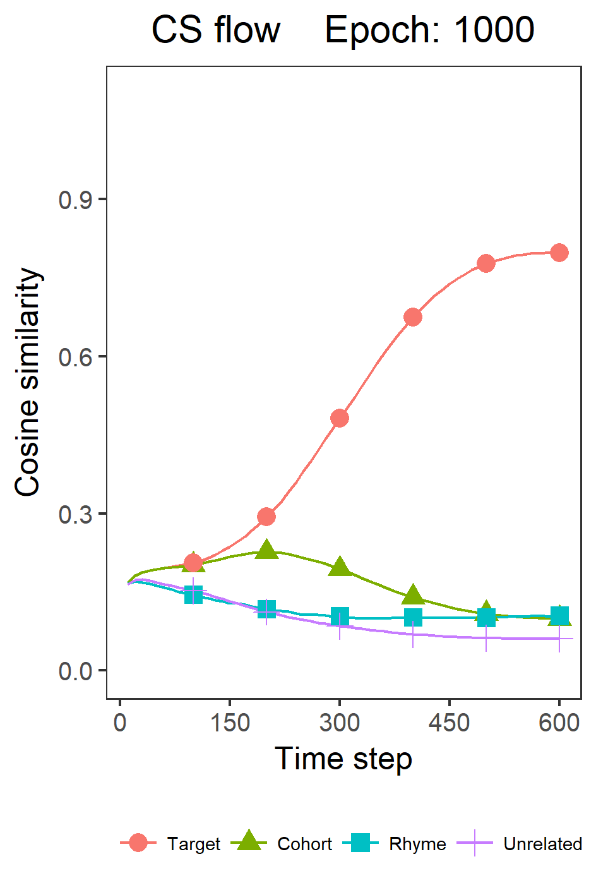
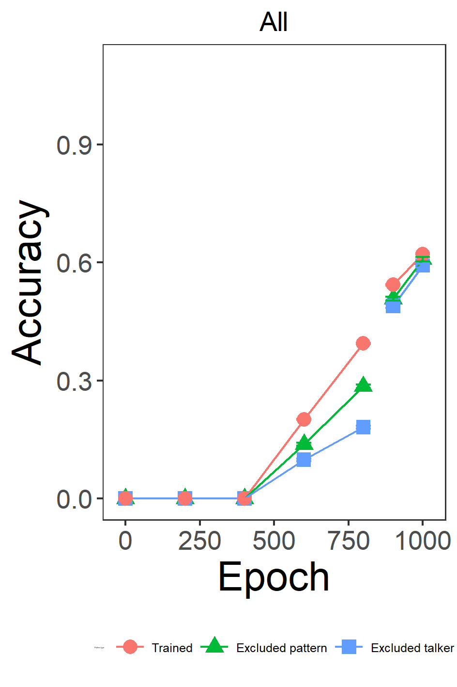
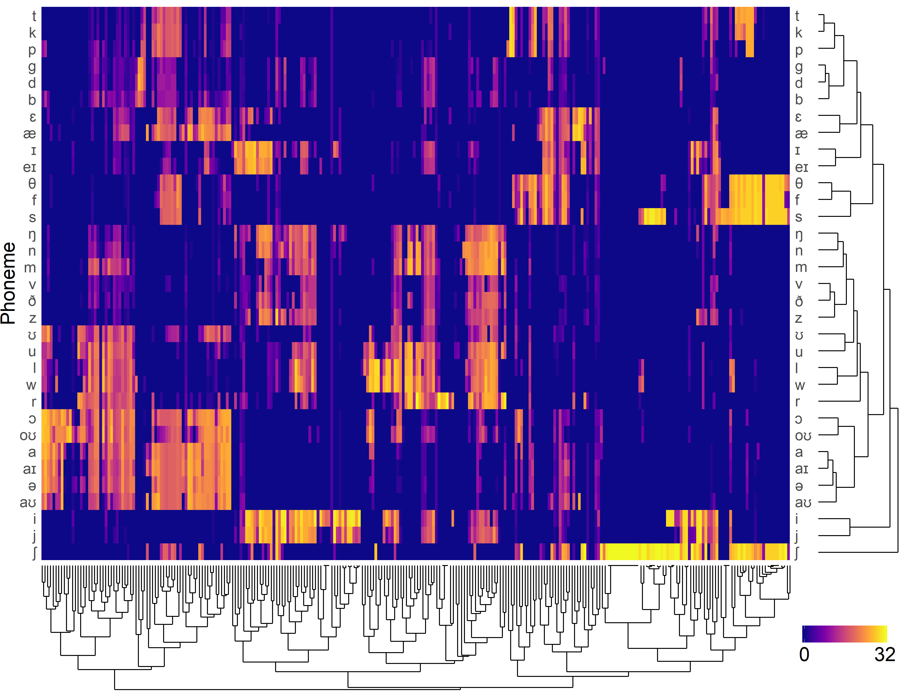
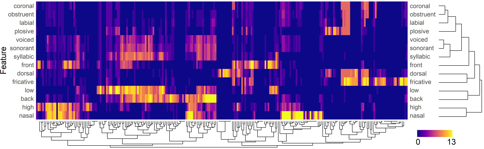
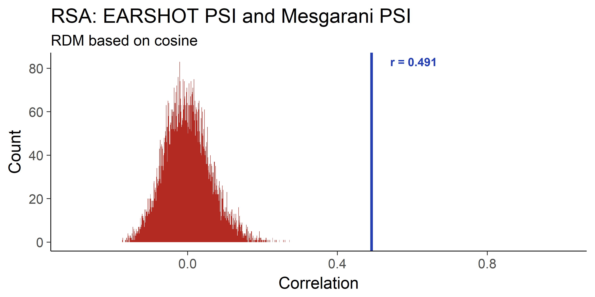
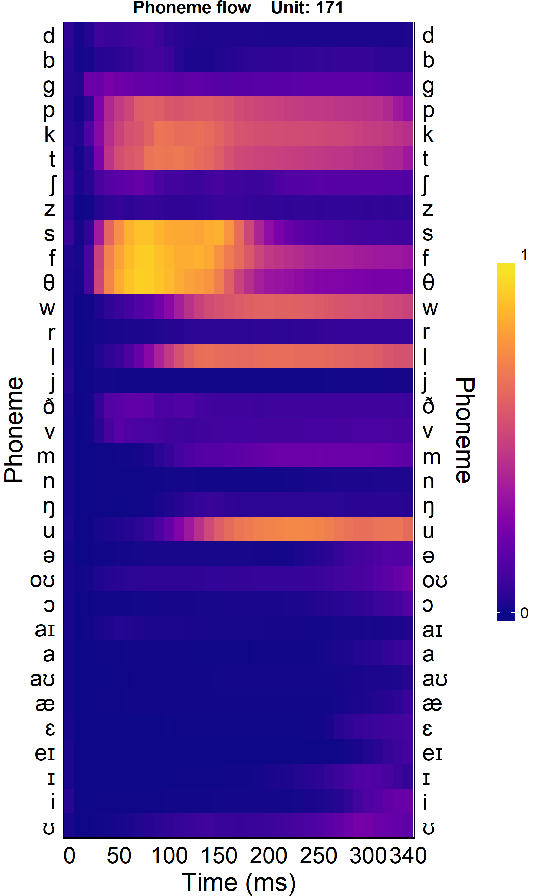
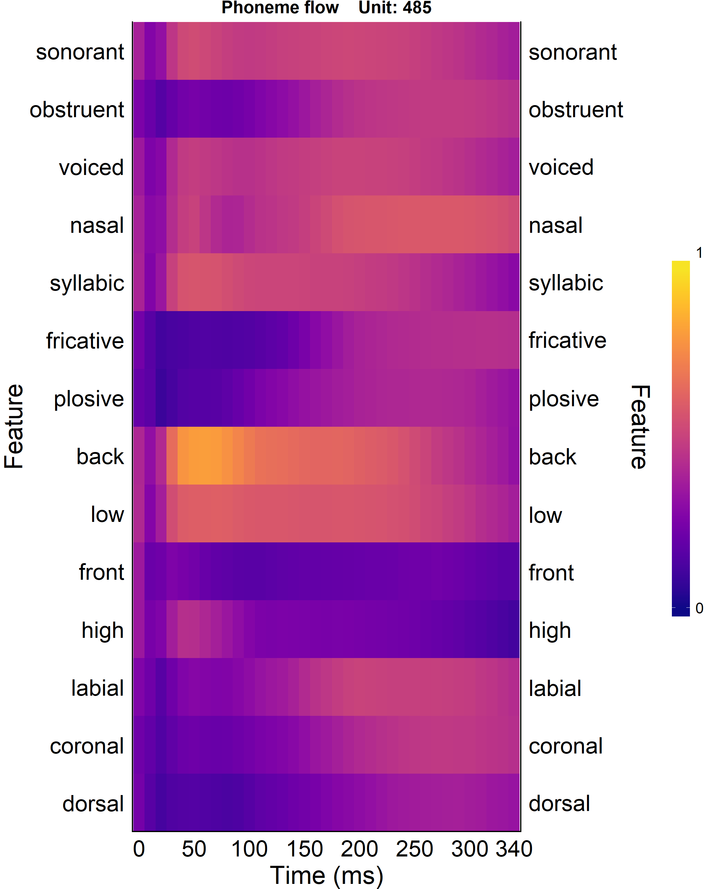
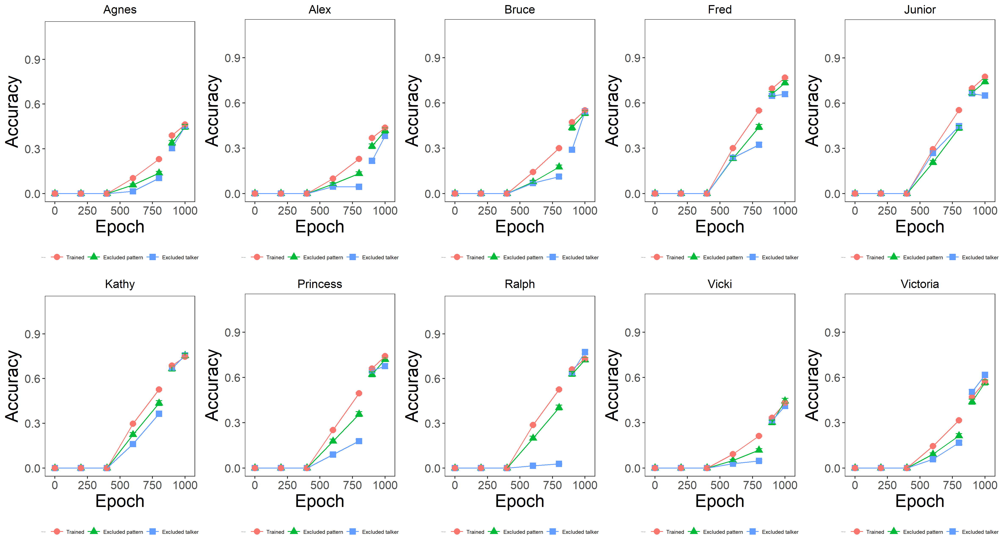
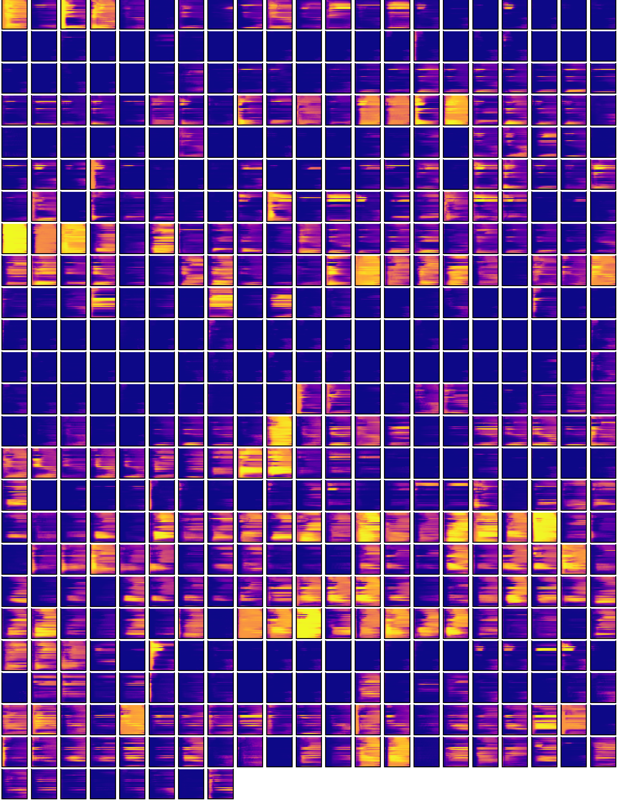

# EARShot 1.1 

Improved version of the EARShot model

Previous version: https://github.com/maglab-uconn/EARSHOT

## Differences from Earlier version

* Before RNN, Convoultion 1D as prenet can be added.
* Some arg parser parameters are moved to 'Hyper_Paremeters.py' file.
* Add pattern generator. Thus, the pattern parameters are changable.
* Improved pattern generator and analyzer to enable large data learning and analysis in low memory environments

## Requiremet

* Tensorflow >=1.13 (It does not support TF 2.0 yet.)
* Librosa >= 0.7.0
* Gensim >= 3.8.1 (Only using Word2Vec)
* FFMPEG

## Structure


## Dataset

### Wavfiles for acoustic pattern

* This Data is generated by the Says of Mac [here](https://drive.google.com/drive/folders/1S09iHmKoX5cGZb3gUWmg2J2ErbstG2tY?usp=sharing)    

* Download diphone wav files for hidden analysis [here](https://drive.google.com/file/d/1poWuCQ1_09jBSaIZJbj5KvBLl4HejdH3/view)

## Hyper parameters

* Pattern parameters
    * Word_List_File
        * List of words to use
        * Please see the example: 'ELP_groupData.csv'
    * Voice_Path
        * The path of dataset
    * Pattern_Path
        * The path of generated dataset
    * Pattern_Metadata_File_Name
        * The metadata file name.
        * Default is 'METADATA.PICKLE'
    * Pattern_Use_Bit
        * Parameter for when TensorFlow supports 16 bit operation
        * Currently is 32 fixed
        
    * Acoutsic_Mode
        * Determine which type of acoustic pattern use.
        * 'Spectrogram' or 'Mel'
    * Semantic_Mode
        * Determine which type of semantic pattern use.
        * 'SRV' or 'Word2Vec'

    * Spectrogram
        * This parameters are used only 'Acoustic_Mode == 'Spectrogram'
        * Sample_Rate            
        * Dimension
        * Frame_Length
        * Frame_Shift        

    * Mel
        * This parameters are used only 'Acoustic_Mode == 'Mel'
        * Sample_Rate
        * Spectrogram_Dim
        * Mel_Dim
        * Frame_Length
        * Frame_Shift
        * Max_Abs
            * If a positive float, pattern is symetric '-Max_Abs to Max_Abs'
            * If 'None', non symmetric '0 to 1'.
        }),

    * SRV
        * This parameters are used only 'Semantic_Mode == 'SRV'
        * Size
            * Determine the size of pattern
        * Assign_Number
            * Determine How many units have 1. Other units have 0.
    
    * Word2Vec
        * This parameters are used only 'Semantic_Mode == 'Word2Vec'
        * DB_File_Path
            * The path of Word2Vec dataset file.
            * Now it is from the gensim based.

* Model parameters
    * Hidden_Type
        * Determine which type of RNN use.
        * 'LSTM', 'ZoneoutLSTM', 'GRU', 'SCRN', 'BPTT'
    * Hidden_Size
        * Determine RNN cell's size
    * Zoneout_Rate
        * This parameters are used only 'Hidden_Type == 'ZoneoutLSTM'
        * During learning, the zoneout rate is determined.
    * Prenet_Conv
        * Channels, Kernel sizes, and strides must be lists of the same size.
        * Use
            * If True, model uses prenet.
            * If false, the sub-parameters of 'Prenet_Conv' will be ignored.
        * Channels
            * Determine the number of filters in each convolution.
            * Ex: [512, 512, 512]
        * Kernel_Sizes
            * Determine the kernel size for each convolution.
            * Ex: [5, 5, 5],
        * Strides
            * Determine the stride size for each convolution.
            * Changing this value affects the number of time steps.
            * Ex: [1, 1, 1]
        * Use_Batch_Normalization
            * If true, model applies batch normalization after convolution.
        * Dropout_Rate
            * Determine a dropout rate during training.
            * *If 'None', there is no dropout.
        }),
    * Weight_Regularization
        * Use
            * If true, model uses weight regularization.
        * Except_Keywords
            * Variables containing the a keyword are excluded from weight regularization.
            * Mainly excludes RNN and Bias.
            * Ex: ['lstm', 'gru', 'scrn', 'rnn', 'bias']
        * Rate
            * Determines the strength of weight regularization applying.

    * Test_Timing
        * Determine the frequency of the inference during learning.
        * A positive integer is required.
    * Checkpoint_Timing
        * Determine the frequency of the checkpoint saving during learning
        * A positive integer is required.
    * Exclusion_Mode
        * Set pattern exclusion method. You can choose between P (pattern based), T (talker based), or M (mix based).
        * If set to P, 1/10 of each talker pattern will not be trained.
        * When set to T, all patterns of one talker are excluded from the learning. The talker can be set via the 'et' parameter.
        * When set to M, patterns are excluded as a mixture of the two methods.
        * When set to None, all patterns will be learned.
    * Test_Only_Identifier_List
        * Determines which talkers are always excluded regardless of the exclusion mode.
        * If nothing, 'None'
        * Ex: ['EO', 'JM'] or None
    * Max_Epoch_with_Exclusion
        * Apply 'Exclusion_Mode' and learn to set epoch.
    * Max_Epoch_without_Exclusion
        * From 'Max_Epoch_with_Exclusion' to the set epoch, 'Exclusion_Mode' is ignored and learned.
        * This is the parameter used to over-training all patterns after normal training.        
        * This parameter must bigger than 'Max_Epoch_with_Exclusion'.
    * Learning_Rate
        * Determine the size of learning rate.
        * A positive float is required.
    * Batch_Size
        * Determine the batch size during learning.
        * When Out of memory occurs, decrease according to the environment(GPU memory).
    * Max_Queue
        * Determines the maximum size of queue saving the next training pattern
    * Extract_Path
        * Determine result and checkpoint save path
    * Result_Split
        * If True, the result data will be stored separately according to 'Batch_Size'.
        * It is recommended to separate if the environment is with a small memory or if there are a lot of learning patterns.
        * If False, save as one file.

## Pattern generate
### Command
```
python Run.Pattern_Generator.py
```

## Model run
```
python EARshot.py [parameters]
```
### Parameters

* `-se <int>`
    * Set the model's start epoch. This parameter and the 'mf' parameter must be set when loading a previously learned model.
    * The default value is 0.

* `-et <talker>`
    * Set which talker pattern is excluded from the learning.
    * Applies if 'em' parameter is T or M, otherwise this parameter is ignored.

* `-idx <int>`
    * Attach an index tag to each result.
    * This value does not affect the performance of the model.

## Result analysis
### Command
```
python Result_Analysis.py [parameters]
```

### Parameters
* `-d <path>`
    * Results directory to run the analysis on.
    * This parameter is required.
    * Ex. `./Results/HM_LSTM.H_512.EM_M.ET_AGNES.IDX_0`

* `-a <float>`
    * Criterion in reaction time calculation of absolute method.
    * The default is 0.7.

* `-r <float>`
    * Criterion in reaction time calculation of relative method.
    * The default is 0.05.

* `-tw <int>`
    * Width criterion in reaction time calculation of time dependent method used in the paper.
    * The default is 10.

* `-th <float>`
    * Height criterion in reaction time calculation of time dependent method used in the paper.
    * The default is 0.05.

### Execution examples

```
python Result_Analysis.py -d ./Results/HM_LSTM.H_512.EM_M.ET_AGNES.IDX_0
python Result_Analysis.py -d ./Results/HM_LSTM.H_512.EM_M.ET_BRUCE.IDX_2 -tw 5 -th 0.1
```

## Hidden analysis
### Command

```
python Hidden_Analysis.py [parameters]
```

### Parameters

* `-d <path>`
    * Results directory to run the analysis on.
    * This parameter is required.
    * Ex. `./Results/HM_LSTM.H_512.EM_M.ET_AGNES.IDX_0`

* `-e <int>`
    * The epoch to run the analysis on.
    * This parameter is required.

* `-v <path>`
    * diphone wav directory to be used for hidden analysis
    * This parameter is required.
    * Ex. `./Diphone_Wav`

### Execution examples

```
python Hidden_Analysis.py -d ./Results/HM_LSTM.H_512.EM_M.ET_AGNES.IDX_0 -e 600 -v ./Diphone_wav
```

## RSA analysis

### Command

```
python RSA_Analysis.py [parameters]
```

### Parameters

* `-d <path>`
    * Results directory to run the analysis on.
    * This parameter is required.
    * Ex. `./Results/IDX_0/HM_LSTM.H_512.EM_M.ET_AGNES.IDX_0`

* `-e <int>`
    * The epoch to run the analysis on.
    * To proceed with the RSA analysis, you must first perform a hidden analysis on the configured epoch.
    * This parameter is required.

* `-c <float>`
    * Criterion of the PSI and FSI map to be used.

* `-pn <int>`
    * Number of permutation tests
    * The default is 1000000.

### Execution examples

```
python RSA_Analysis.py -d ./Results/IDX_0/HM_LSTM.H_512.EM_M.ET_AGNES.IDX_0 -e 2000 -c 0.0 -pn 10000
```


## Generate figures by R script

### Accuracy and cosine similarity flow

#### Method

1. Use `./R_Script/Acc_and_CS_Flow(Fig.3).R`

2. Modify the parameters in line 116 - 123

3. Run. The result will be in `base_Dir`.

#### Result example


### PSI and FSI

#### Method

1. Use `./R_Script/PSI_and_FSI(Fig.4).R`

2. Modify the parameters in line 36 - 41

3. Run. The result will be in each talker's hidden analysis directory.

#### Result example



### RSA permutation test

#### Method

1. Use `./R_Script/RSA_Permutation_Test(Fig.5).R`

2. Modify the parameters in line 7 - 12

3. Run. The result will be in each talker's hidden analysis directory.

#### Result example


### Phoneme and feature flow

#### Method

1. Use `./R_Script/Phoneme_and_Feature_Flow(Fig.6).R`

2. Modify the parameters in line 10 - 15

3. Run. The result will be in each talker's hidden analysis directory.

#### Result example


### Accuracy flow integration by talker

This is different 'Accuracy and cosine similarity flow'. This analysis checks the accuracy of the talker's data in all simulations.

#### Method

1. Use `./R_Script/Acc_Flow_Integration_by_Talker(Fig.S2.1).R`

2. Modify the parameters in line 53 - 60

3. Run. The result will be in `base_Dir`.

#### Result example


### Phoneme and feature flow tile

#### Method

1. Use `./R_Script/Phoneme_and_Feature_Flow_All_Tile(Fig.S2.2-3).R`

2. Modify the parameters in line 22 - 29

3. Run. The result will be in each talker's hidden analysis directory.

#### Result example


### Phoneme and feature flow compare

#### Method

1. Use `./R_Script/Phoneme_and_Feature_Flow_Compare(Fig.S2.4).R`

2. Modify the parameters in line 10 - 17

3. Run. The result will be in each talker's hidden analysis directory.

#### Result example

